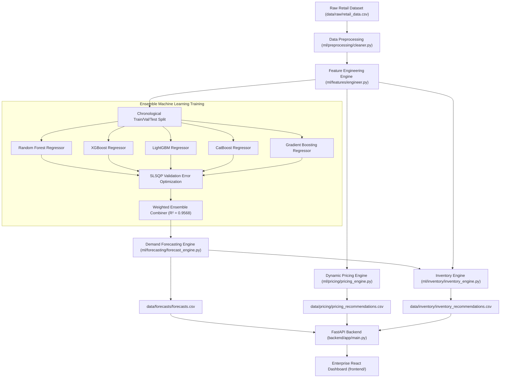

# AI-Driven Intelligent Retail Analytics: Demand Forecasting, Dynamic Pricing, and Inventory Optimization Using Ensemble Techniques

> **Major Project** | B.Tech Computer Science (Data Science)  
> **Database-Free Architecture** | File-Based Data Persistence (`CSV`, `Parquet`, `JSON`, `Joblib`)

---

## 🌟 Executive Summary

**DemandIQ** is an enterprise-grade intelligent retail analytics platform that integrates:
1. **Multi-Model Demand Forecasting** using 5 ensemble base regressors (Random Forest, XGBoost, LightGBM, CatBoost, Gradient Boosting).
2. **Dynamic Pricing Optimization** subject to demand elasticity and non-zero cost bounds ($P \ge C$).
3. **Inventory Optimization** computing Safety Stock, Reorder Point (ROP), and Order Quantity (ROQ) from lead-time demand variance.
4. **Explainable AI (SHAP)** delivering feature attributions for model transparency.
5. **Interactive Executive Dashboard** built with React, TypeScript, Tailwind CSS, and Recharts.

> [!IMPORTANT]
> **STRICT DATABASE-FREE ARCHITECTURE**: This platform uses **NO database** (No PostgreSQL, MySQL, MongoDB, SQLite, Redis, Supabase, or Firebase). All data ingestion, intermediate feature stores, ML model binaries, and decision outputs persist in file storage (`data/`, `models/`, `reports/`).

---

## 📐 Core System Architecture



---

## 🛠️ Technology Stack

- **Frontend**: React 18, TypeScript, Tailwind CSS v4, Recharts, Lucide React, Vite.
- **Backend API**: Python 3.14, FastAPI, Pydantic v2, Uvicorn.
- **Machine Learning**: Scikit-Learn, XGBoost, LightGBM, CatBoost, SciPy.
- **Explainability**: SHAP (SHapley Additive exPlanations).
- **Data & Serialization**: Pandas, NumPy, PyArrow (Parquet), Joblib, JSON.

---

## 📊 Dataset & Feature Engineering

The dataset comprises **36,500 daily retail records** spanning **2 full years (2024–2025)** across 5 stores and 10 SKU products across 4 categories.

### Engineered Features & Leakage Prevention
To prevent time-series target leakage:
- **Calendar Indicators**: `year`, `month`, `day`, `dayofweek`, `quarter`, `is_weekend`, `weekofyear`.
- **Shifted Historical Lags**: `lag_1` ($t-1$), `lag_7` ($t-7$), `lag_14` ($t-14$), `lag_28` ($t-28$).
- **Rolling Window Statistics**: 7, 14, and 28-day rolling means and standard deviations computed exclusively on `units_sold.shift(1)`.
- **Pricing Features**: `price_margin`, `price_margin_ratio`, `price_change`.

---

## 🤖 Model Evaluation & Ensemble Performance

Models were evaluated using a strict chronological split (Train: 2024 to Aug 2025, Validation: Sept–Oct 2025, Test: Nov–Dec 2025).

| Model Architecture | MAE (Units) | RMSE | R² Score | WAPE (%) | SMAPE (%) | Optimal Weight |
| :--- | :---: | :---: | :---: | :---: | :---: | :---: |
| **Random Forest** | 10.7774 | 15.5914 | 0.9307 | 11.87% | 13.51% | 0.00% |
| **XGBoost** | 8.8632 | 12.2182 | 0.9574 | 9.76% | 11.18% | 26.75% |
| **LightGBM** | 8.8956 | 12.3277 | 0.9567 | 9.79% | 11.22% | 33.63% |
| **CatBoost** | 9.3468 | 13.1462 | 0.9507 | 10.29% | 11.63% | 39.62% |
| **Gradient Boosting** | 8.9887 | 12.4135 | 0.9561 | 9.90% | 11.32% | 0.00% |
| **Weighted Ensemble** | **8.8844** | **12.3050** | **0.9568** | **9.78%** | **11.18** | **100.0%** |

$$\hat{y}_{ensemble} = 0.2675 \cdot \text{XGBoost} + 0.3363 \cdot \text{LightGBM} + 0.3962 \cdot \text{CatBoost}$$

---

## 📈 Key Modules Specification

### 1. Dynamic Pricing Engine
Evaluates candidate price multipliers ($P_{cand} \in [0.80 P_{current}, 1.25 P_{current}]$).
$$\text{Expected Profit} = (P_{cand} - C_{cost}) \times \hat{D}(P_{cand})$$
- Enforces strict cost bound $P_{cand} \ge C_{cost}$.

### 2. Inventory Optimization Engine
- **Safety Stock**: $SS = Z \times \sigma_D \times \sqrt{L}$ ($Z=1.645$ for 95% service level).
- **Reorder Point**: $ROP = (\mu_D \times L) + SS$.
- **Recommended Order Quantity**: $ROQ = \max(0, \lceil ROP + D_{30d} - S_{current} \rceil)$.

---

## 🎓 Academic Defense & Viva Questions

### Q1: Why is demand forecasting necessary in retail?
**A**: Retail supply chains suffer from the Bullwhip Effect. Accurate demand forecasting minimizes carrying costs, avoids stock-out lost sales, and optimizes inventory turns.

### Q2: Why use an Ensemble of Random Forest, XGBoost, LightGBM, CatBoost, and Gradient Boosting?
**A**: Ensemble techniques reduce model variance and bias by combining diverse decision-tree partitioning strategies (bagging vs gradient boosting vs categorical splitting in CatBoost).

### Q3: How is data leakage prevented in time-series forecasting?
**A**: All lag and rolling features are created using `shift(1)` of historical observations. Shuffling is strictly avoided, and validation/test splits are strictly chronological.

### Q4: How does the application store data without a database?
**A**: The platform uses modular file services (`pandas`, `pyarrow`, `joblib`, `json`) reading and writing structured files in `data/`, `reports/`, and `models/`.

---

## 🚀 Running the Project

### 1. Train Models & Generate Predictions
```bash
python scripts/train_models.py
python scripts/generate_predictions.py
```

### 2. Launch FastAPI Backend
```bash
uvicorn backend.app.main:app --port 8000
```

### 3. Launch React Dashboard
```bash
cd frontend
npm run dev
```
Open [http://localhost:5173](http://localhost:5173).

---

## 📁 Repository Directory Structure

```
DemandIQ/
├── data/
│   ├── raw/retail_data.csv
│   ├── processed/engineered_features.parquet
│   ├── forecasts/forecasts.csv
│   ├── pricing/pricing_recommendations.csv
│   └── inventory/inventory_recommendations.csv
├── models/
│   ├── random_forest.joblib
│   ├── xgboost.joblib
│   ├── lightgbm.joblib
│   ├── catboost.joblib
│   ├── gradient_boosting.joblib
│   └── ensemble_config.json
├── reports/
│   ├── model_metrics.csv
│   └── feature_importance.csv
├── ml/
│   ├── preprocessing/cleaner.py
│   ├── features/engineer.py
│   ├── training/train.py
│   ├── forecasting/forecast_engine.py
│   ├── pricing/pricing_engine.py
│   └── inventory/inventory_engine.py
├── backend/app/main.py
├── frontend/src/
├── scripts/
│   ├── preprocess.py
│   ├── train_models.py
│   └── generate_predictions.py
└── tests/test_pipeline.py
```
